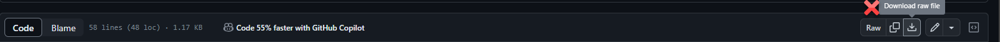

# Using VBA on GitHub
This project is here to help you configure your VBA project on GitHub.

# Why should you include .gitignore and .gitattributes files to your project?

**.gitignore**: This file is there to help Git determine what files it should ignore when committing changes to the project. It will allow you to avoid uploading content that you don't want to or that you don't need to.

**.gitattributes**: This file will help you make sure that there won't be errors due to Git conversion of your files.

# .gitignore

A template .gitignore file is provided here: 

📖 https://github.com/DecimalTurn/Using-VBA-on-GitHub/blob/main/gitignore/.gitignore

## Explanations

Luckily for us, the VBE doesn't really create local or temporary files that you don't want to share outside of your computer (unlike for other IDEs like [VScode](https://github.com/github/gitignore/blob/main/Global/VisualStudioCode.gitignore)). However, the Office application you are using might create temporary files that remain on the disk as long as the Office document is open to indicate to others that someone is working in the file ([more details](https://superuser.com/questions/405257/what-type-of-file-is-file)).

This is why an exclusion exists for this type of file (starting with ~$):
```
~$*
```

Sometimes, you'll be working from an actual Office document and only want to share the code as `.bas`, `.frm` and `.frx` files (not the office document itself). In that case, feel free to add extensions for Office documents extensions to your .gitignore file. Some of them are already in the template .gitignore file as commented-out lines. Just remove the "#" at the start of the line to add them back as needed.

### Weird brackets?
You'll notice that the .gitignore (and .gitattributes) files make use of this syntax with brackets to specify file paths:
eg.
```ignore
*.[xX][lL][aA]
```

This is because git configurations are case-sensitive: if we don't want to use 2 lines for each file extension (uppercase and lowercase version), we need to take advantage of the [glob pattern syntax](https://en.wikipedia.org/wiki/Glob_(programming)#Syntax) to combine lowercase and uppercase letters into pairs contained in those bracket. It's a bit harder to read, but I'm sure you'll get used to it. 

# .gitattributes

There is 2 ways you can configure your .gitattributes file. Both of them have their pros and cons, but the I would suggest you to use the first method to avoid issues like [this one](https://github.com/VBA-tools/VBA-Dictionary/issues/38) if you project becomes really popular.

1) CRLF everywhere ([template](https://github.com/DecimalTurn/VBA-on-GitHub/blob/main/gitattributes/CRLF%20everywhere/.gitattributes)): This approach will make sure that Git doesn't touch to your code files. It won't perfom any line endings or text encoding conversion.

2) CRLF in Working Directory only ([template](https://github.com/DecimalTurn/VBA-on-GitHub/blob/main/gitattributes/CRLF%20in%20Working%20Directory%20only/.gitattributes)): This version will make sure that VBA related files are encoded using UTF-8 and Unix-style line endings (LF) when they are committed to the Git index. This is to better work with the GitHub UI which is often expecting those specific encodings to work properly.

Disclaimer: Converting your files to use UTF-8 and LF line endings means that people that want to download your code might have a problem if they try to download the a raw file with code.


## Should you specify the `working-tree-encoding` attribute?

Probably no, unless you have code comment in a language other than English. You should never have non-ASCII characters in code that is shared outside your computer because those character will appear differently on someone with a machine using a different encoding due to language configurations. Note that non-ASCII characters won't appear correctly one other people's machine using a different encoding either, but at least it won't change the behavior of the program. The only benefit of using `working-tree-encoding` is that you'll have a better experience using certain GitHub features, since GitHub has some issues when dealing with non-UTF8 encoding ([example](https://github.com/orgs/community/discussions/77064)).

If you still want to specify the encoding, then it would look like this:
`*.bas [...] working-tree-encoding=CP1252`

In this case, I'm using CP1252 which is the usual Windows code page for Windows OS in North American and Western Europe, but it might differ on your system. To get the number that goes after "cp" on your local machine, you can run the following Powershell command :
```
Get-WinSystemLocale | Select-Object @{ n='ANSI Code Page';   e={ $_.TextInfo.AnsiCodePage } }
```
[<sup>source</sup>](https://serverfault.com/questions/80635/how-can-i-manually-determine-the-codepage-and-locale-of-the-current-os/836221#836221)


Note: Regarding the attribute `linguist-language=vba`, I choose not to include it in those because I believe that GitHub's system to detect if a file is VBA or not is decent and if your files aren't detected as VBA, it might be telling you somethig about your code.
  - Make sure that your files include the VBE's metadata such as the `Attribute VB_Name = "..."`
  - Use the right file extensions
  - If you `.bas` files doesn't contain any VBA specific syntax, maybe it's OK if is classified as VB6 instead.

# Upcoming sections:
- Section about .editorcondig? Eg.: https://github.com/DecimalTurn/Excel-Pomodoro-Timer/blob/main/.editorconfig
