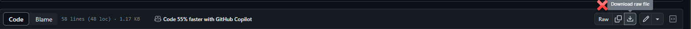

This version will make sure that VBA related files contain Unix-style line endings (LF) when they are committed to the Git index. This is to better work with the GitHub UI which is often expecting those specific encodings to work properly.

Disclaimer: Converting your files to LF line endings means that people that want to download your code might have a problem if they try to download a raw file with code.

